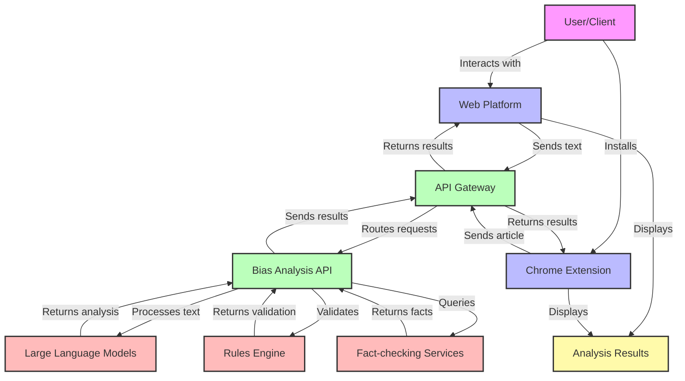
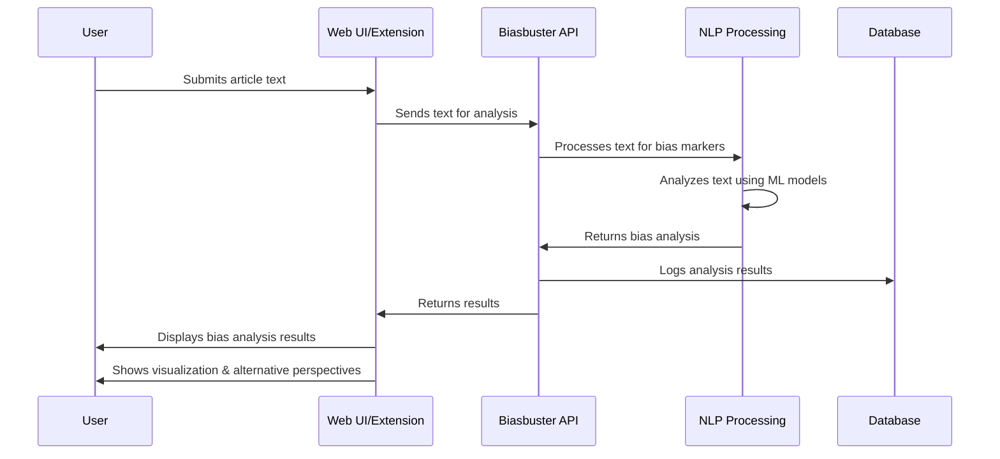
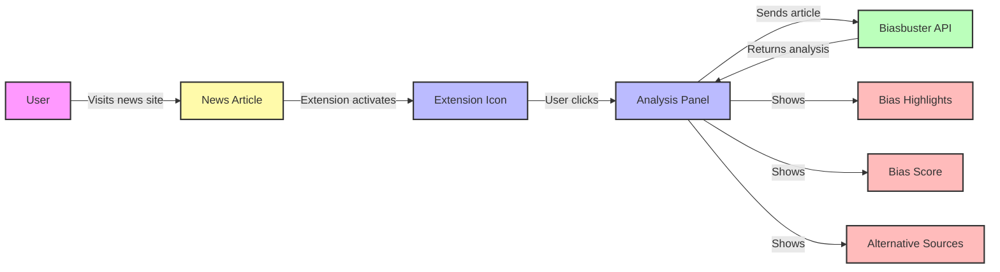
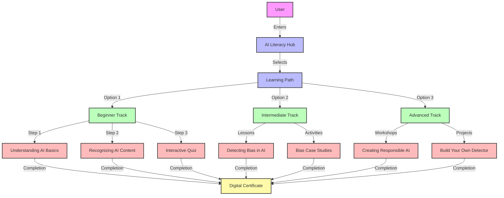
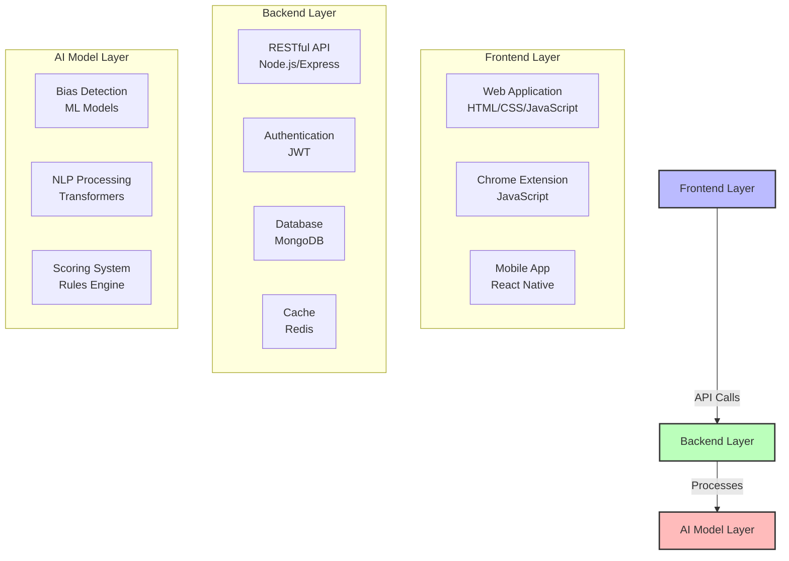

# Biasbuster Project Flowcharts

This document provides visual representations of the key workflows and architecture within the Biasbuster project.

## System Architecture

## Bias Detection Workflow

## Chrome Extension Flow

## AI Literacy Training Module Flow

## Technical Implementation

These diagrams provide a high-level overview of the Biasbuster system architecture and workflows. For more detailed documentation, please refer to the technical specifications in the project documentation. 