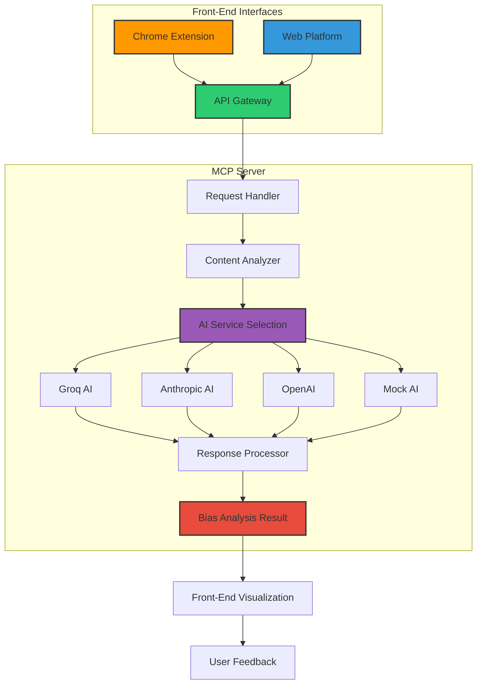
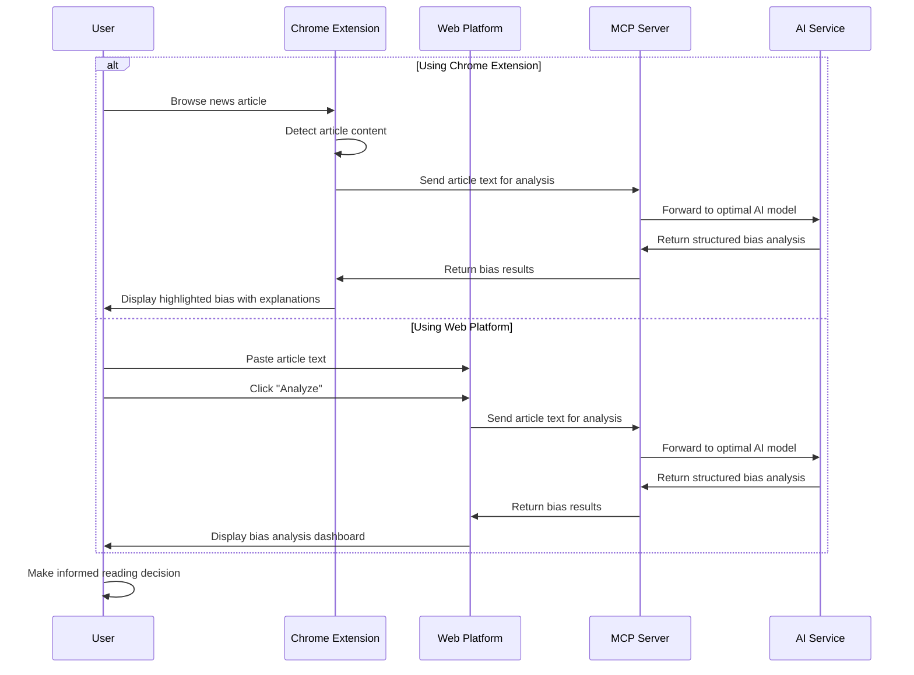
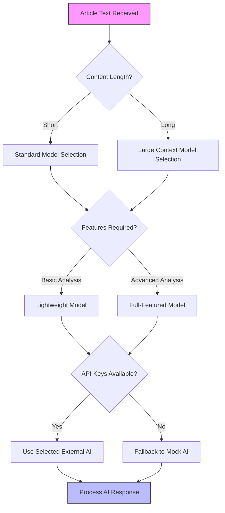
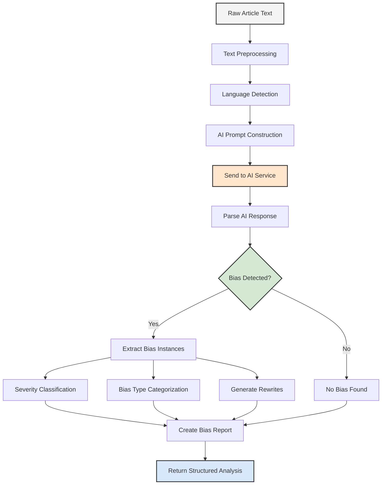
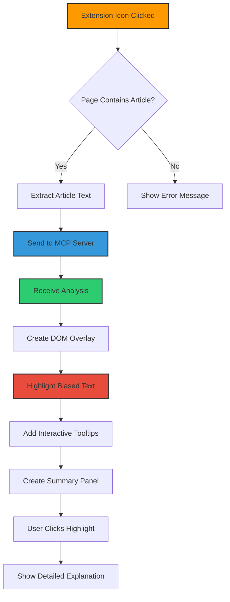
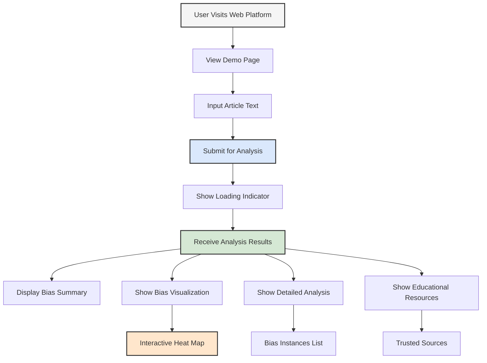
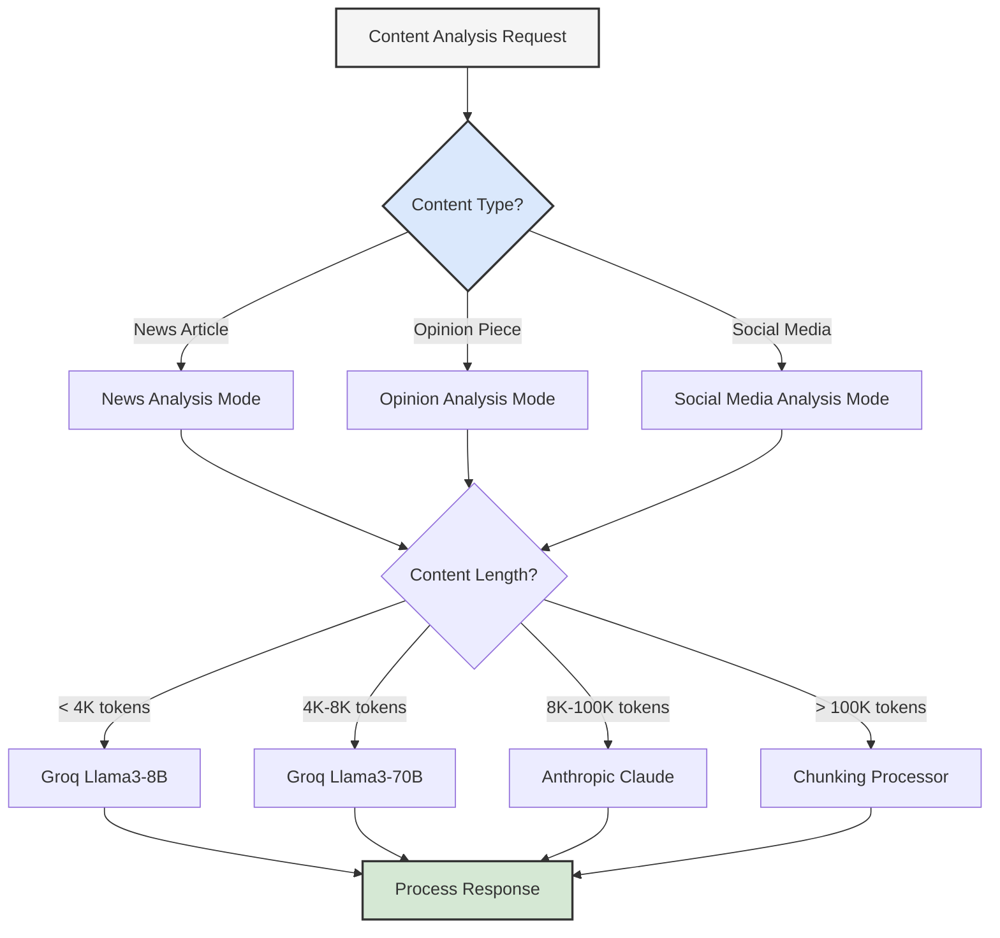
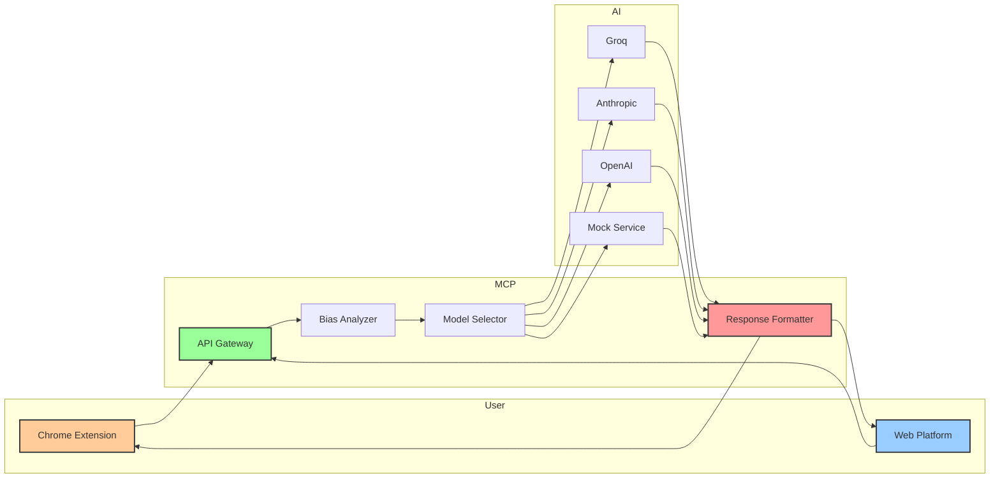

# Biasbuster Workflow Flowchart

This document visualizes the workflow and architecture of the Biasbuster system.

## Core System Architecture

## User Workflow

## AI Model Selection Process

## Bias Detection Process

## Chrome Extension Architecture

## Web Platform Interface Flow

## Multi-Model AI Integration

## Data Flow Architecture

