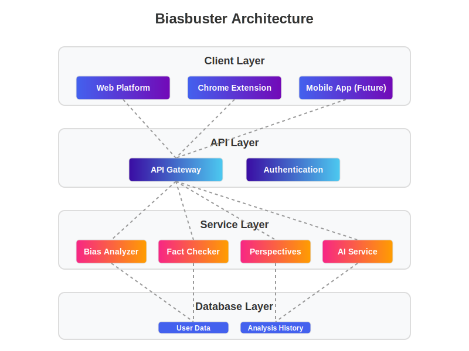

# Biasbuster


Biasbuster is an AI-powered media literacy tool designed to help users detect and understand bias in online content. It includes a Chrome extension, web platform, and API service for analyzing text across multiple dimensions of bias.

<p align="center">
  
</p>

## 🚀 Quick Demo

Check out Biasbuster in action:

<p align="center">
  
</p>

## 🌟 Features

- **Chrome Extension**: Analyze any webpage for bias directly while browsing
- **Web Platform**: Upload text or articles for comprehensive bias analysis
- **Multi-dimensional Analysis**: Identifies political bias, emotional language, framing, and more
- **Educational Resources**: AI literacy and media literacy educational content
- **Ethical Framework**: Built with transparency and ethics in mind

## 📸 Screenshots

<p align="center">
  
  
</p>

## 🛠️ Getting Started

### Prerequisites

- Node.js 14+ (16+ recommended)
- NPM or Yarn
- Chrome browser (for extension)

### Installation

1. Clone the repository:
   ```
   git clone https://github.com/amarzeus/Biasbuster.git
   cd Biasbuster
   ```

2. Install dependencies:
   ```
   npm install
   ```

3. Build the project:
   ```
   npm run build
   ```

4. Start the server:
   ```
   npm start
   ```

### Installing the Chrome Extension

1. Open Chrome and navigate to `chrome://extensions/`
2. Enable "Developer mode"
3. Click "Load unpacked" and select the `chrome-extension` folder from this repository
4. The Biasbuster icon should appear in your browser toolbar

## 🏗️ Project Structure

```
Biasbuster/
├── src/                # Backend API server source code
├── web-platform/       # Web platform front-end
├── chrome-extension/   # Chrome extension source
├── prompts/            # AI prompts for bias analysis
├── docs/               # Documentation and assets
└── scripts/            # Utility scripts
```

## 📊 Flowchart

See [FLOWCHART.md](FLOWCHART.md) for a visual representation of how Biasbuster works.

## 📚 Documentation

- [Architecture](ARCHITECTURE.md): Detailed system architecture
- [Product Requirements](Biasbuster%20Product%20Requirements%20Document%20-%20PRD.md): Product specifications
- [Developer Guide](DEVELOPER.md): Guide for developers

## 🧪 Running Tests

```
npm test
```

## 🤝 Contributing

Contributions are welcome! Please see [CONTRIBUTING.md](CONTRIBUTING.md) for guidelines.

## 📄 License

This project is licensed under the MIT License - see the [LICENSE](LICENSE) file for details.

## 👨‍💻 Author

Made with ❤️ by [Amar](https://www.linkedin.com/in/amarmahakal/)

## 🙏 Support

If you find this project helpful, please consider giving it a star on GitHub and supporting the developer:

<a href="https://buymeacoffee.com/amarmahakal">
  
</a>
