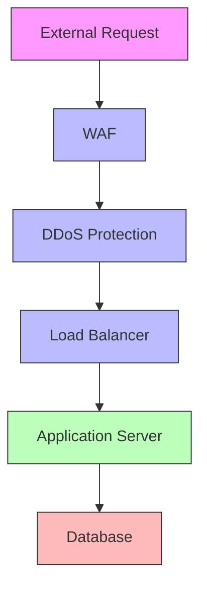

# Security Policy

## Security Commitment

At Biasbuster, security is our top priority. We are committed to protecting our users' data, privacy, and the integrity of our systems through industry-leading security practices and continuous monitoring.

## Reporting a Vulnerability

### Responsible Disclosure

We appreciate the efforts of security researchers and the broader community in helping us maintain high security standards. If you discover a security vulnerability, please:

1. Email: security@biasbuster.com
2. Subject: "Security Vulnerability Report"
3. Include detailed information about the vulnerability
4. Provide steps to reproduce (if possible)

### Response Timeline

- **24 hours**: Initial acknowledgment
- **48 hours**: Preliminary assessment
- **7 days**: Detailed evaluation and response
- **30 days**: Target resolution time
- **90 days**: Public disclosure (if agreed upon)

## Security Measures

### 1. Infrastructure Security



#### Protection Layers
- Web Application Firewall (WAF)
- DDoS protection
- Network segmentation
- Regular security scans
- Intrusion detection

### 2. Data Security

#### Encryption
- Data at rest: AES-256
- Data in transit: TLS 1.3
- Key management: AWS KMS
- Regular key rotation

#### Access Control
- Role-based access (RBAC)
- Principle of least privilege
- Multi-factor authentication
- Regular access reviews

### 3. Application Security

#### Secure Development
- OWASP Top 10 compliance
- Regular security training
- Code security reviews
- Automated security testing

#### Authentication
- Strong password policies
- MFA requirement
- Session management
- JWT security

### 4. Compliance

#### Standards
- SOC 2 Type II
- ISO 27001
- GDPR
- CCPA

#### Auditing
- Regular security audits
- Penetration testing
- Vulnerability scanning
- Compliance reviews

## Security Controls

### 1. Technical Controls

```typescript
// Example Security Middleware
const securityMiddleware = {
  headers: {
    'Content-Security-Policy': "default-src 'self'",
    'X-Frame-Options': 'DENY',
    'X-XSS-Protection': '1; mode=block',
    'X-Content-Type-Options': 'nosniff'
  },
  rateLimit: {
    windowMs: 15 * 60 * 1000, // 15 minutes
    max: 100 // limit each IP to 100 requests per windowMs
  }
};
```

### 2. Administrative Controls
- Security policies
- Risk assessments
- Employee training
- Incident response

### 3. Physical Controls
- Data center security
- Access restrictions
- Environmental controls
- Backup systems

## Incident Response

### 1. Detection
- Security monitoring
- Alert systems
- User reports
- Automated scanning

### 2. Response
- Incident classification
- Containment measures
- Investigation process
- Stakeholder communication

### 3. Recovery
- System restoration
- Data recovery
- Service verification
- Post-incident analysis

### 4. Prevention
- Root cause analysis
- Security improvements
- Process updates
- Training updates

## Security Testing

### 1. Automated Testing
- SAST (Static Analysis)
- DAST (Dynamic Analysis)
- Dependency scanning
- Container scanning

### 2. Manual Testing
- Penetration testing
- Code reviews
- Architecture reviews
- Configuration audits

## Best Practices

### 1. Password Security
- Minimum 12 characters
- Complex requirements
- Regular rotation
- Password manager support

### 2. Access Management
- Regular access reviews
- Prompt termination
- Audit logging
- Session controls

### 3. Data Protection
- Data classification
- Retention policies
- Secure deletion
- Backup procedures

## Security Resources

### 1. Documentation
- Security guidelines
- Incident response
- Best practices
- Training materials

### 2. Tools
- Security scanners
- Monitoring tools
- Analysis tools
- Testing frameworks

## Version Control

| Version | Date | Changes | Author |
|---------|------|---------|--------|
| 1.0 | [Date] | Initial Policy | [Name] |
| 1.1 | [Date] | Updated Controls | [Name] |

## Contact

- Security Team: security@biasbuster.com
- Emergency: +1-XXX-XXX-XXXX
- PGP Key: [Key ID]

---

This security policy is regularly reviewed and updated. Last update: [Date]
