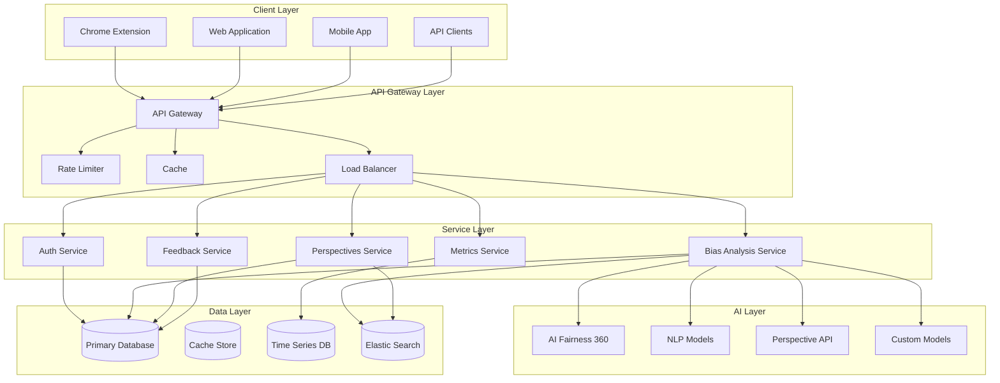
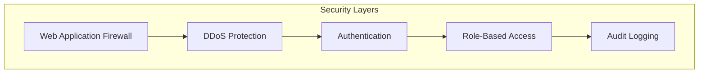
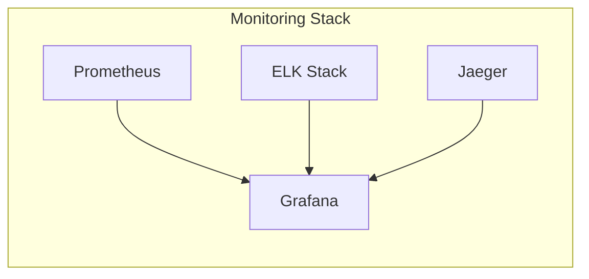
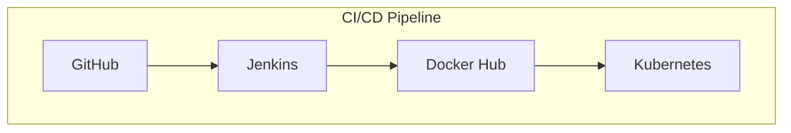

# Biasbuster Architecture

## System Overview

## Core Components

### 1. Client Layer
- **Chrome Extension**
  - Real-time content analysis
  - Local bias detection
  - Offline capabilities
  - Secure storage

- **Web Application**
  - React-based SPA
  - Server-side rendering
  - Progressive enhancement
  - Accessibility compliance

- **Mobile App**
  - React Native implementation
  - Cross-platform support
  - Native performance optimizations

### 2. API Gateway Layer
- **API Gateway**
  - Request routing
  - Authentication
  - Rate limiting
  - Request/Response transformation

- **Load Balancer**
  - Round-robin distribution
  - Health checking
  - SSL termination
  - High availability

### 3. Service Layer
- **Auth Service**
  - JWT-based authentication
  - OAuth2/OpenID Connect
  - Role-based access control
  - MFA support

- **Bias Analysis Service**
  - Multi-model orchestration
  - Real-time analysis
  - Batch processing
  - Model versioning

- **Perspectives Service**
  - Content classification
  - Sentiment analysis
  - Context understanding
  - Historical tracking

### 4. AI Layer
- **AI Fairness 360**
  - Bias metrics calculation
  - Fairness algorithms
  - Model debiasing
  - Metric visualization

- **Custom Models**
  - Domain-specific bias detection
  - Transfer learning
  - Continuous training
  - A/B testing

### 5. Data Layer
- **Primary Database**
  - PostgreSQL
  - Sharding
  - Replication
  - Backup strategy

- **Cache Store**
  - Redis
  - In-memory caching
  - Session management
  - Rate limiting

## Security Architecture

### Security Features
1. **WAF Protection**
   - SQL injection prevention
   - XSS protection
   - CSRF protection
   - Input validation

2. **Authentication**
   - Multi-factor authentication
   - JWT tokens
   - Session management
   - Password policies

3. **Authorization**
   - Role-based access control
   - Resource-level permissions
   - API scope control
   - IP whitelisting

## Scalability

### Horizontal Scaling
- Kubernetes orchestration
- Auto-scaling policies
- Load balancing
- Service mesh

### Vertical Scaling
- Resource optimization
- Performance monitoring
- Capacity planning
- Database optimization

## Monitoring & Observability

### Metrics Collection
- System metrics
- Business metrics
- Custom metrics
- SLA monitoring

### Logging
- Structured logging
- Log aggregation
- Log analysis
- Alert management

## Deployment Architecture

### Deployment Features
- Blue-green deployments
- Canary releases
- Rollback capability
- Infrastructure as Code

## Performance Optimization

### Caching Strategy
- Multi-level caching
- Cache invalidation
- Cache warming
- Cache analytics

### Database Optimization
- Query optimization
- Index management
- Connection pooling
- Replication strategy

## Disaster Recovery

### Backup Strategy
- Automated backups
- Point-in-time recovery
- Geographic replication
- Backup testing

### Recovery Procedures
- Failover procedures
- Data recovery
- Service restoration
- Communication plan

## Integration Points

### External Services
- IBM Watson
- Google Cloud
- Azure AI
- AWS Services
- Custom APIs

### Internal Services
- Authentication
- Analytics
- Reporting
- Monitoring

## Future Considerations

### Planned Improvements
- GraphQL API
- Event-driven architecture
- Machine learning pipeline
- Real-time analytics

### Technology Evaluation
- New AI models
- Performance tools
- Security enhancements
- Scalability solutions

## References
- [System Design Documentation](./system-design.md)
- [API Documentation](./api.md)
- [Security Policy](./SECURITY.md)
- [Deployment Guide](./deployment-guide.md)
