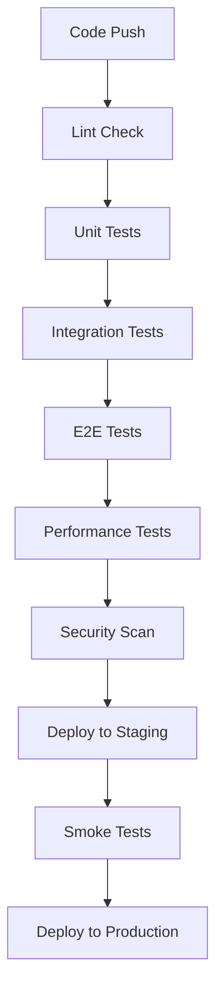

# Test Automation Plan

## Overview

This document outlines the comprehensive test automation strategy for Biasbuster, ensuring quality, reliability, and continuous validation of all system components.

## Test Automation Framework

### Core Technologies
- Jest for Unit/Integration Testing
- Cypress for E2E Testing
- k6 for Performance Testing
- Playwright for Browser Testing
- GitHub Actions for CI/CD

## Test Categories

### 1. Unit Tests
```typescript
// Example Unit Test Structure
describe('BiasAnalyzer', () => {
  test('should detect bias in text', async () => {
    const analyzer = new BiasAnalyzer();
    const result = await analyzer.analyze('sample text');
    expect(result.hasBias).toBeDefined();
    expect(result.score).toBeGreaterThanOrEqual(0);
  });
});
```

### 2. Integration Tests
```typescript
// Example Integration Test
describe('API Integration', () => {
  test('should process analysis request', async () => {
    const response = await request(app)
      .post('/api/analyze')
      .send({ text: 'sample content' });
    expect(response.status).toBe(200);
    expect(response.body.analysis).toBeDefined();
  });
});
```

### 3. E2E Tests
```typescript
// Example Cypress Test
describe('Chrome Extension', () => {
  it('should analyze page content', () => {
    cy.visit('test-page.html');
    cy.get('#analyze-btn').click();
    cy.get('#results').should('be.visible');
    cy.get('#bias-score').should('exist');
  });
});
```

### 4. Performance Tests
```javascript
// Example k6 Test Script
export default function() {
  const response = http.post('http://api.biasbuster.com/analyze', {
    text: 'performance test content'
  });
  check(response, {
    'status is 200': (r) => r.status === 200,
    'response time < 500ms': (r) => r.timings.duration < 500
  });
}
```

## Test Coverage Requirements

### Frontend Coverage
- React Components: 90%
- State Management: 95%
- Utility Functions: 100%
- Event Handlers: 90%

### Backend Coverage
- Controllers: 95%
- Services: 95%
- Models: 100%
- Middleware: 100%

### AI/ML Coverage
- Model Validation: 95%
- Data Preprocessing: 100%
- Bias Detection: 95%
- Results Processing: 100%

## Continuous Integration Pipeline



## Automated Test Scenarios

### 1. Chrome Extension Tests
- Installation verification
- Content analysis
- UI responsiveness
- Settings persistence
- Error handling

### 2. Web Platform Tests
- User authentication
- Dashboard functionality
- Report generation
- Data visualization
- API integration

### 3. API Tests
- Endpoint validation
- Rate limiting
- Authentication
- Error handling
- Response formats

### 4. AI Model Tests
- Accuracy validation
- Bias detection
- Performance metrics
- Edge cases
- Model versioning

## Performance Testing Goals

### Response Times
- API: < 500ms
- UI Interactions: < 100ms
- Analysis: < 1s
- Reports: < 2s

### Load Testing
- Concurrent Users: 10,000
- Requests/Second: 1,000
- Error Rate: < 0.1%

## Security Testing

### Automated Scans
- OWASP Top 10
- Dependency vulnerabilities
- Code security
- API security

### Compliance Tests
- GDPR compliance
- Data protection
- Privacy requirements
- Audit logging

## Test Data Management

### Test Data Sets
- Sample content
- Known bias cases
- Edge cases
- Performance data

### Data Generation
```typescript
// Example Test Data Generator
class TestDataGenerator {
  generateBiasedContent() {
    return {
      text: 'biased content example',
      expectedScore: 0.8,
      categories: ['gender', 'age']
    };
  }
}
```

## Reporting and Monitoring

### Test Reports
- Coverage reports
- Performance metrics
- Error logs
- Trend analysis

### Monitoring
- Test execution times
- Failure rates
- Coverage trends
- Performance trends

## Automation Best Practices

### Code Quality
- Consistent naming
- Clear documentation
- Code reviews
- Regular refactoring

### Test Maintenance
- Regular updates
- Dependency management
- Framework upgrades
- Documentation updates

## Implementation Schedule

### Phase 1: Core Testing
- Unit test framework
- Basic integration tests
- CI pipeline setup

### Phase 2: Advanced Testing
- E2E test suite
- Performance testing
- Security scanning

### Phase 3: Optimization
- Coverage improvements
- Performance optimization
- Report enhancement

## Resources

### Tools and Libraries
- Jest
- Cypress
- k6
- Playwright
- GitHub Actions

### Documentation
- Test framework docs
- Best practices guide
- Setup instructions
- Maintenance guide

## Version History

| Version | Date | Changes | Author |
|---------|------|---------|--------|
| 1.0 | [Date] | Initial version | [Name] |
| 1.1 | [Date] | Added AI testing | [Name] |
