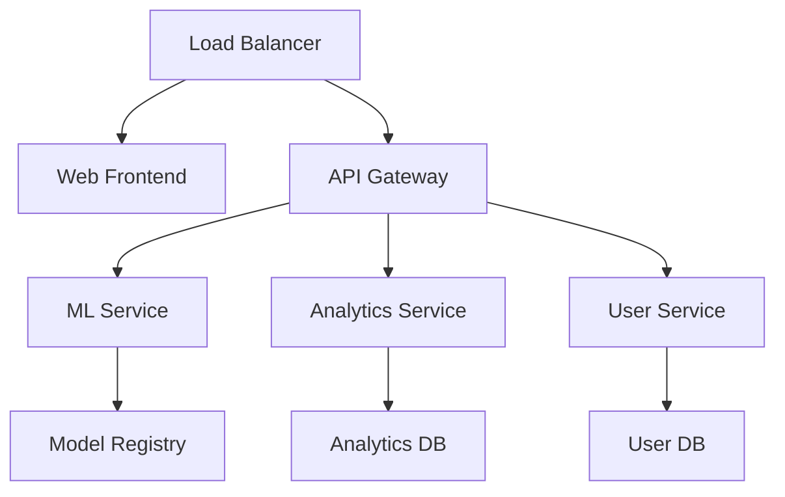

# Biasbuster Deployment Guide

## Overview

This guide covers the deployment process for the Biasbuster platform, including the web application, Chrome extension, and ML services.

## Prerequisites

- Node.js 18.x or later
- Python 3.9 or later
- Docker 20.x or later
- Kubernetes 1.24 or later (for production)
- PostgreSQL 14.x
- Redis 6.x
- NVIDIA GPU (for ML inference)

## System Requirements

### Production Environment
- CPU: 8+ cores
- RAM: 32GB+
- Storage: 100GB+ SSD
- GPU: NVIDIA A100 or equivalent
- Network: 1Gbps+

### Development Environment
- CPU: 4+ cores
- RAM: 16GB+
- Storage: 50GB+ SSD
- GPU: NVIDIA T4 or equivalent
- Network: 100Mbps+

## Deployment Architecture



## Deployment Steps

### 1. Environment Setup

```bash
# Clone repository
git clone https://github.com/biasbuster/biasbuster.git
cd biasbuster

# Install dependencies
npm install
pip install -r requirements.txt

# Set up environment variables
cp .env.example .env
# Edit .env with your configuration
```

### 2. Database Setup

```bash
# Initialize PostgreSQL
docker-compose up -d postgres
npm run db:migrate

# Initialize Redis
docker-compose up -d redis
```

### 3. ML Model Deployment

```bash
# Build ML service
docker build -t biasbuster/ml-service -f docker/ml.Dockerfile .

# Deploy ML service
docker-compose up -d ml-service
```

### 4. Web Application Deployment

```bash
# Build web application
npm run build

# Deploy web application
docker-compose up -d web
```

### 5. Chrome Extension Deployment

```bash
# Build extension
npm run build:extension

# Package extension
npm run package:extension
```

## Configuration

### Environment Variables

```env
# Application
NODE_ENV=production
PORT=3000
API_URL=https://api.biasbuster.com

# Database
DB_HOST=localhost
DB_PORT=5432
DB_NAME=biasbuster
DB_USER=admin
DB_PASSWORD=secret

# Redis
REDIS_HOST=localhost
REDIS_PORT=6379

# ML Service
ML_SERVICE_URL=http://localhost:5000
MODEL_PATH=/models/bias-detector
BATCH_SIZE=32
```

### Kubernetes Configuration

```yaml
# deployment.yaml
apiVersion: apps/v1
kind: Deployment
metadata:
  name: biasbuster-web
spec:
  replicas: 3
  selector:
    matchLabels:
      app: biasbuster-web
  template:
    metadata:
      labels:
        app: biasbuster-web
    spec:
      containers:
      - name: web
        image: biasbuster/web:latest
        ports:
        - containerPort: 3000
        env:
        - name: NODE_ENV
          value: "production"
```

## Monitoring

### Metrics Collection

```yaml
# prometheus.yml
global:
  scrape_interval: 15s

scrape_configs:
  - job_name: 'biasbuster'
    static_configs:
      - targets: ['localhost:3000']
```

### Logging

```yaml
# logging.yaml
version: '3'
services:
  loki:
    image: grafana/loki:latest
    ports:
      - "3100:3100"
    command: -config.file=/etc/loki/local-config.yaml
```

## Security

### SSL/TLS Configuration

```nginx
# nginx.conf
server {
    listen 443 ssl;
    server_name biasbuster.com;

    ssl_certificate /etc/nginx/ssl/biasbuster.crt;
    ssl_certificate_key /etc/nginx/ssl/biasbuster.key;

    location / {
        proxy_pass http://localhost:3000;
    }
}
```

### API Security

```typescript
// security.ts
import { rateLimit } from 'express-rate-limit';
import helmet from 'helmet';

app.use(helmet());
app.use(rateLimit({
  windowMs: 15 * 60 * 1000,
  max: 100
}));
```

## Scaling

### Horizontal Scaling

```yaml
# scaling.yaml
apiVersion: autoscaling/v2
kind: HorizontalPodAutoscaler
metadata:
  name: biasbuster-web
spec:
  scaleTargetRef:
    apiVersion: apps/v1
    kind: Deployment
    name: biasbuster-web
  minReplicas: 3
  maxReplicas: 10
  metrics:
  - type: Resource
    resource:
      name: cpu
      target:
        type: Utilization
        averageUtilization: 70
```

## Backup and Recovery

### Database Backup

```bash
# Backup script
#!/bin/bash
pg_dump -U admin biasbuster > backup_$(date +%Y%m%d).sql
```

### Model Backup

```bash
# Model backup script
#!/bin/bash
aws s3 cp /models/bias-detector s3://biasbuster-models/backup_$(date +%Y%m%d)/
```

## Troubleshooting

### Common Issues

1. **ML Service Not Responding**
   - Check GPU availability
   - Verify model loading
   - Check service logs

2. **Database Connection Issues**
   - Verify credentials
   - Check network connectivity
   - Review connection pool settings

3. **Extension Installation Fails**
   - Verify manifest.json
   - Check Chrome Web Store requirements
   - Review extension permissions

## Support

For deployment support:
- Email: deploy@biasbuster.com
- Documentation: https://docs.biasbuster.com/deployment
- Status: https://status.biasbuster.com 