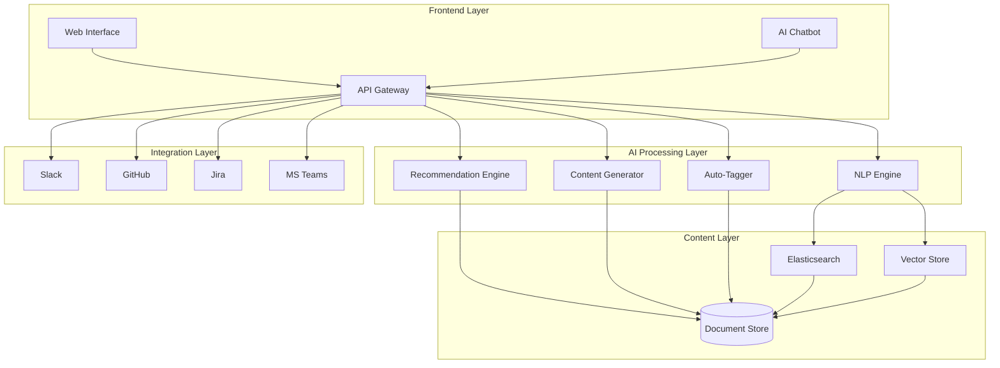
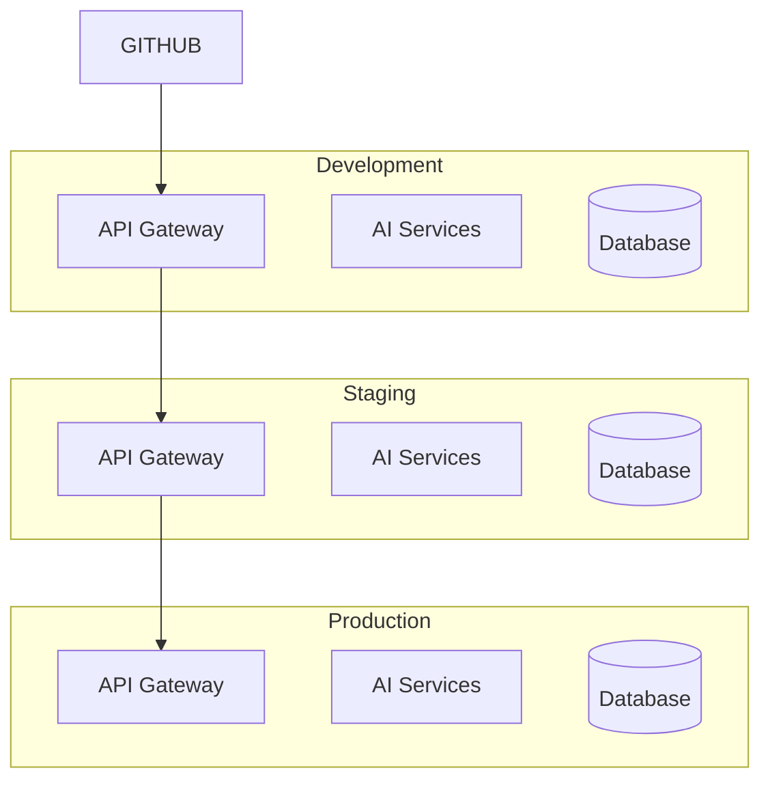

# AI-Powered Knowledge Base Architecture

## System Overview




## Core Components

### 1. AI Engine Stack

#### NLP Processing
```typescript
interface NLPEngine {
  // Semantic search with context
  search(query: string, context?: SearchContext): Promise<SearchResult[]>;
  
  // Question answering
  answerQuestion(question: string, context: string): Promise<Answer>;
  
  // Entity recognition
  extractEntities(text: string): Promise<Entity[]>;
}
```

#### Recommendation System
```typescript
interface RecommendationEngine {
  // Get personalized content recommendations
  getRecommendations(userId: string, context: Context): Promise<Article[]>;
  
  // Update user preferences
  updateUserPreferences(userId: string, preferences: Preferences): Promise<void>;
  
  // Train recommendation model
  trainModel(trainingData: TrainingData): Promise<void>;
}
```

#### Content Generation
```typescript
interface ContentGenerator {
  // Generate new article drafts
  generateArticle(topic: string, context: Context): Promise<ArticleDraft>;
  
  // Update existing content
  updateContent(articleId: string, changes: Changes): Promise<Article>;
  
  // Generate summaries
  generateSummary(content: string): Promise<string>;
}
```

### 2. Storage Architecture

#### Document Store
```typescript
interface DocumentStore {
  // CRUD operations
  createDocument(doc: Document): Promise<string>;
  getDocument(id: string): Promise<Document>;
  updateDocument(id: string, updates: Partial<Document>): Promise<Document>;
  deleteDocument(id: string): Promise<void>;
  
  // Version control
  getVersion(id: string, version: number): Promise<Document>;
  listVersions(id: string): Promise<Version[]>;
}
```

#### Vector Store
```typescript
interface VectorStore {
  // Vector operations
  addVectors(vectors: Vector[]): Promise<void>;
  searchSimilar(vector: Vector, k: number): Promise<SearchResult[]>;
  updateVectors(updates: VectorUpdate[]): Promise<void>;
}
```

### 3. Integration Layer

#### API Gateway
```typescript
interface APIGateway {
  // Authentication
  authenticate(credentials: Credentials): Promise<Token>;
  
  // Rate limiting
  checkRateLimit(token: Token): Promise<boolean>;
  
  // Request routing
  routeRequest(request: Request): Promise<Response>;
}
```

#### External Integrations
```typescript
interface ExternalIntegration {
  // Sync content
  syncContent(content: Content): Promise<void>;
  
  // Handle webhooks
  handleWebhook(payload: WebhookPayload): Promise<void>;
  
  // Push notifications
  notify(notification: Notification): Promise<void>;
}
```

## Implementation Guidelines

### 1. AI Model Training

```python
class KnowledgeBaseAI:
    def train_models(self):
        # Train NLP model
        self.nlp_model = train_nlp_model(
            data=self.training_data,
            model_type="all-mpnet-base-v2",
            epochs=10
        )
        
        # Train recommendation model
        self.rec_model = train_recommendation_model(
            user_data=self.user_interactions,
            content_data=self.content_features
        )
```

### 2. Content Processing Pipeline

```python
class ContentProcessor:
    def process_content(self, content: str):
        # Extract entities and metadata
        entities = self.nlp_engine.extract_entities(content)
        
        # Generate embeddings
        embeddings = self.embedding_model.encode(content)
        
        # Auto-tag content
        tags = self.auto_tagger.generate_tags(content)
        
        # Store in vector database
        self.vector_store.add_vectors({
            'content': content,
            'embeddings': embeddings,
            'metadata': {
                'entities': entities,
                'tags': tags
            }
        })
```

### 3. Search Implementation

```python
class SemanticSearch:
    def search(self, query: str):
        # Generate query embedding
        query_embedding = self.embedding_model.encode(query)
        
        # Search vector store
        results = self.vector_store.search(
            vector=query_embedding,
            k=5,
            threshold=0.85
        )
        
        # Rerank results
        reranked = self.reranker.rerank(
            query=query,
            results=results
        )
        
        return reranked
```

## Security Considerations

### 1. Data Protection
- Encryption at rest (AES-256)
- TLS 1.3 for data in transit
- Regular security audits
- Access logging

### 2. Access Control
- Role-based access control (RBAC)
- JWT authentication
- API key management
- Rate limiting

## Monitoring and Analytics

### 1. Performance Metrics
- Response times
- Search accuracy
- Content freshness
- User engagement

### 2. Usage Analytics
- Popular searches
- Failed queries
- Content gaps
- User feedback

## Deployment Architecture



## Version History

| Version | Date | Changes | Author |
|---------|------|---------|--------|
| 1.0 | [Date] | Initial Architecture | [Name] |
| 1.1 | [Date] | Added AI Components | [Name] |
