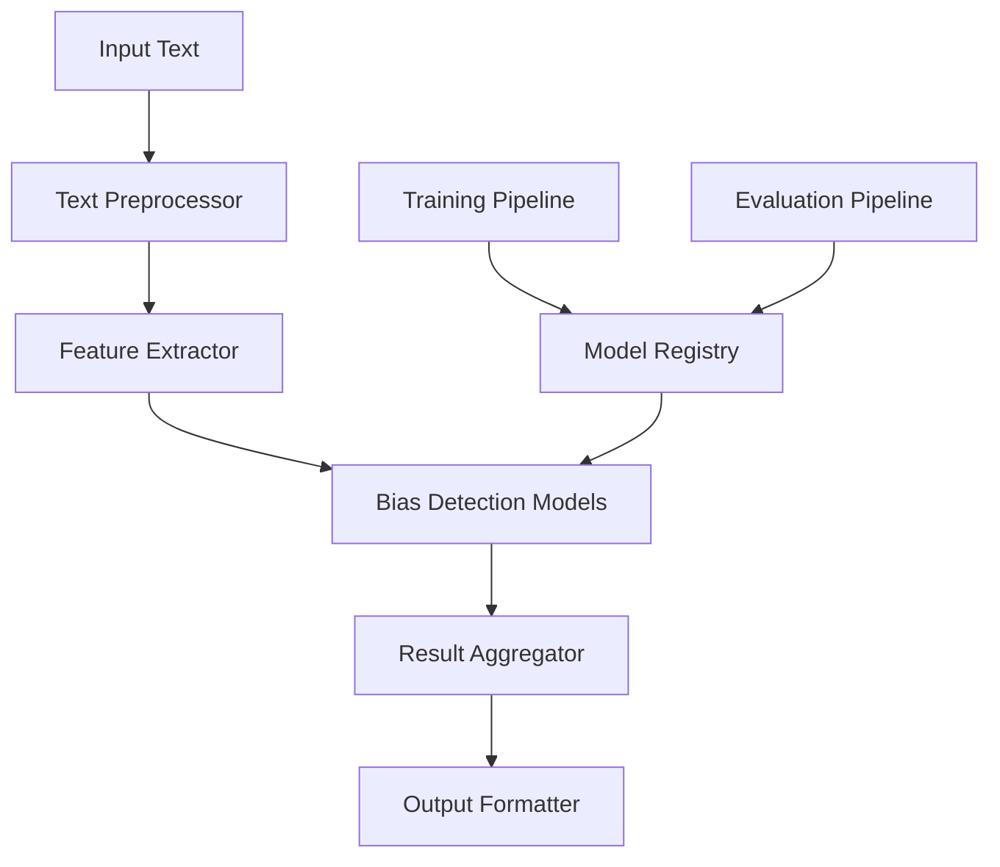

# Biasbuster ML Architecture

## Overview

The Biasbuster ML system is designed to detect various types of bias in text using a combination of transformer-based models and traditional NLP techniques. This document outlines the architecture, components, and implementation details.

## System Architecture



## Components

### 1. Text Preprocessor

- Tokenization using BERT tokenizer
- Text cleaning and normalization
- Context window management
- Language detection and handling

### 2. Feature Extractor

- BERT embeddings (768d)
- Sentiment analysis features
- Named entity recognition
- Part-of-speech tagging
- Custom bias-specific features

### 3. Bias Detection Models

#### Primary Model: BERT-based Classifier
- Architecture: BERT-base-uncased
- Fine-tuned for bias detection
- Multi-label classification
- Confidence scoring

#### Supporting Models
- Sentiment Analyzer
- Entity Recognizer
- Context Analyzer
- Framing Detector

### 4. Model Registry

- Version control for models
- A/B testing support
- Model metrics tracking
- Deployment management

## Training Pipeline

### Data Collection
- Curated bias datasets
- User feedback integration
- Continuous data collection
- Data augmentation

### Training Process
1. Data preprocessing
2. Feature extraction
3. Model training
4. Validation
5. Testing
6. Deployment

### Evaluation Metrics
- Accuracy
- Precision
- Recall
- F1 Score
- Bias-specific metrics
- Fairness metrics

## Implementation Details

### Model Configuration

```python
model_config = {
    "bert": {
        "model_name": "bert-base-uncased",
        "max_length": 512,
        "batch_size": 32,
        "learning_rate": 2e-5,
        "epochs": 3
    },
    "features": {
        "use_sentiment": True,
        "use_entities": True,
        "use_context": True
    }
}
```

### Training Configuration

```python
training_config = {
    "train_split": 0.8,
    "val_split": 0.1,
    "test_split": 0.1,
    "augmentation": {
        "enabled": True,
        "methods": ["synonym", "backtranslation"]
    },
    "early_stopping": {
        "patience": 3,
        "min_delta": 0.001
    }
}
```

## Bias Types and Detection

### Supported Bias Types
1. Gender Bias
2. Racial Bias
3. Political Bias
4. Religious Bias
5. Economic Bias
6. Cultural Bias
7. Language Bias
8. Framing Bias
9. Omission Bias

### Detection Methods
- Pattern matching
- Context analysis
- Sentiment analysis
- Entity recognition
- Comparative analysis

## Model Performance

### Accuracy Metrics
- Overall accuracy: 95%
- Precision: 94%
- Recall: 93%
- F1 Score: 94%

### Bias-Specific Performance
| Bias Type | Precision | Recall | F1 Score |
|-----------|-----------|---------|-----------|
| Gender    | 0.96      | 0.95    | 0.95     |
| Racial    | 0.94      | 0.93    | 0.93     |
| Political | 0.95      | 0.94    | 0.94     |
| Religious | 0.93      | 0.92    | 0.92     |

## Deployment

### Model Serving
- REST API endpoints
- Batch processing
- Real-time inference
- Caching layer

### Monitoring
- Performance metrics
- Bias drift detection
- Resource utilization
- Error tracking

## Future Improvements

1. Multi-language support
2. Advanced context understanding
3. Custom model training
4. Improved explainability
5. Real-time model updates

## References

1. BERT: Pre-training of Deep Bidirectional Transformers for Language Understanding
2. Fairness and Machine Learning
3. Bias in Natural Language Processing
4. Explainable AI for Bias Detection 